# 技术文档图表 - Mermaid 语法参考

> 本页面提供 Mermaid 各类图表的语法模板，Agent 生成技术文档时可直接参考使用。
> 上级页面：[[技术文档图表-选型指南]]

---

## 1. 架构图 / 流程图（Graph）

### 有向图（从上到下）
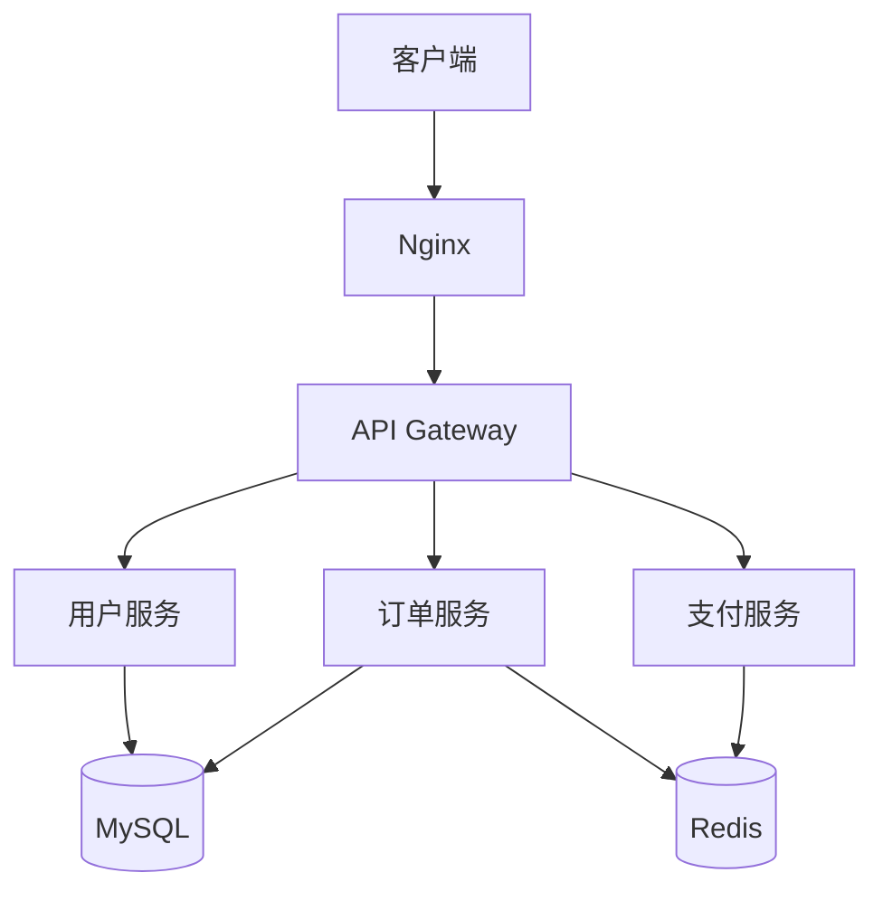

### 有向图（从左到右）
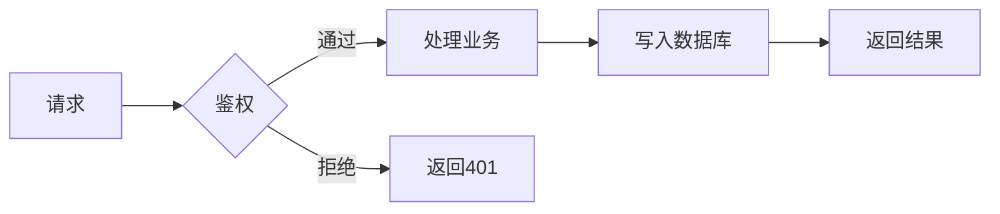

### 子图（分层架构）
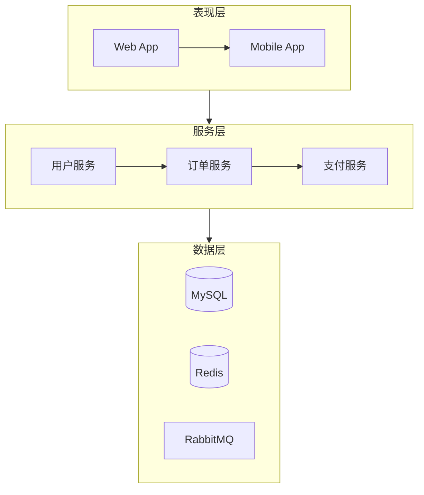

### 样式设置
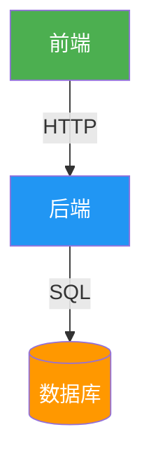

---

## 2. 时序图（Sequence Diagram）

### 基础时序图
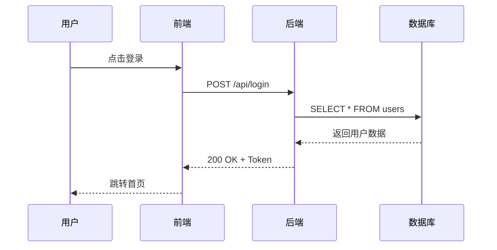

### 带循环和条件
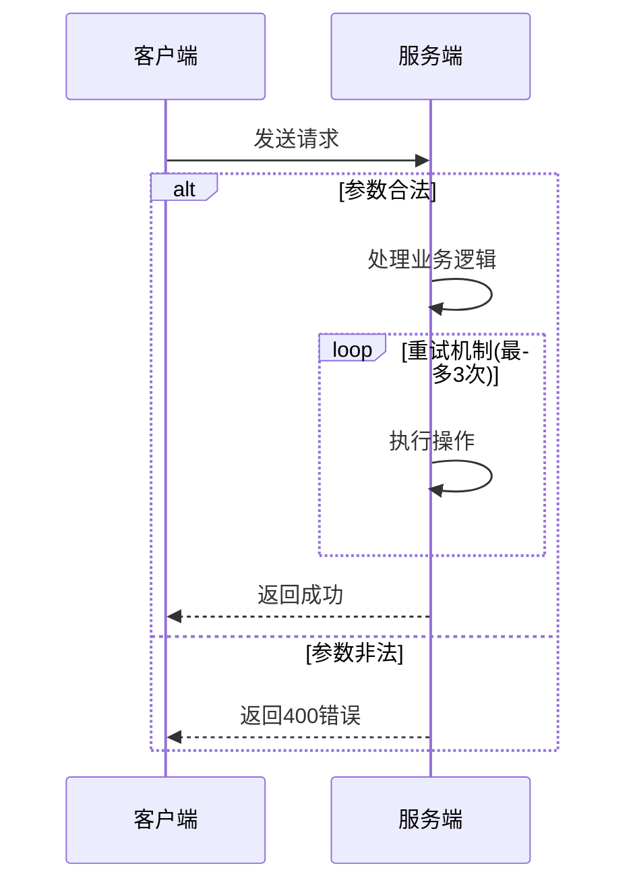

### 带激活条和注释
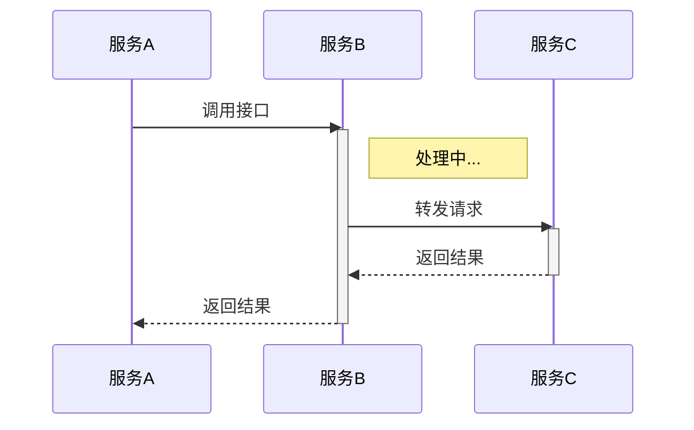

---

## 3. ER 图（Entity Relationship Diagram）

### 基础 ER 图
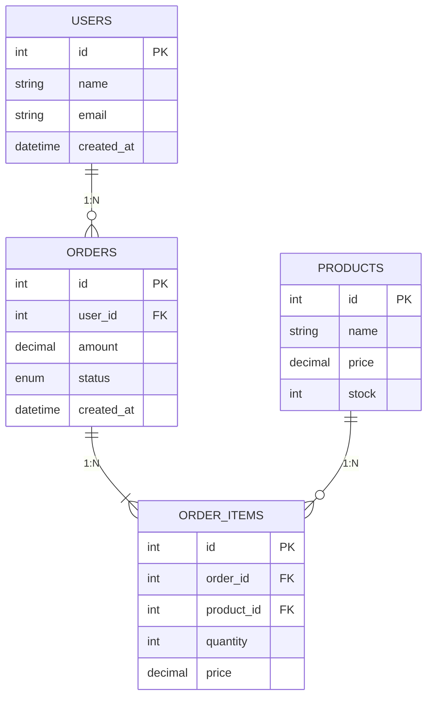

### 关系类型说明
| 符号 | 含义 | 示例 |
|------|------|------|
| `\|\|--\|\|` | 一对一 | 用户-身份证 |
| `\|\|--o{` | 一对多 | 用户-订单 |
| `}o--o{` | 多对多 | 学生-课程 |
| `\|\|-\|{` | 一对多(强制) | 订单-订单项 |

---

## 4. 状态图（State Diagram）

### 基础状态图
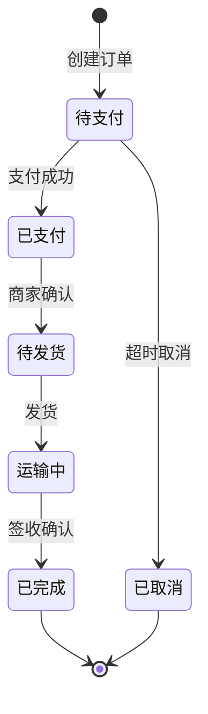

### 复合状态
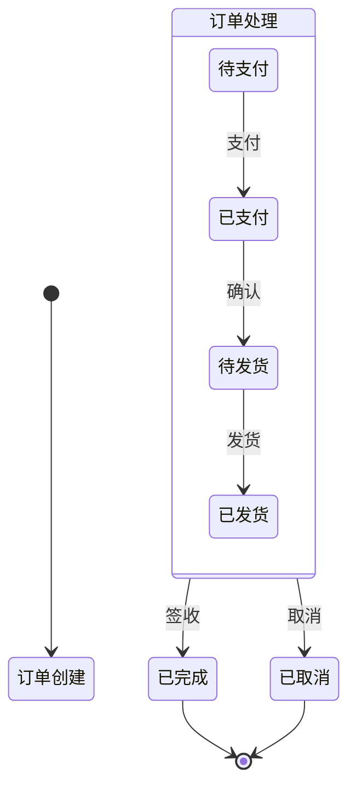

### 带条件分支
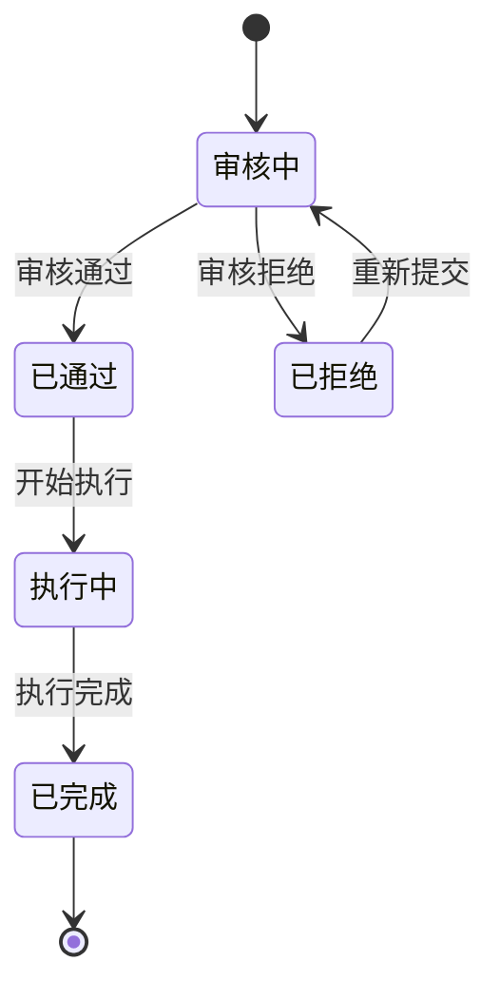

---

## 5. 类图（Class Diagram）

### 基础类图
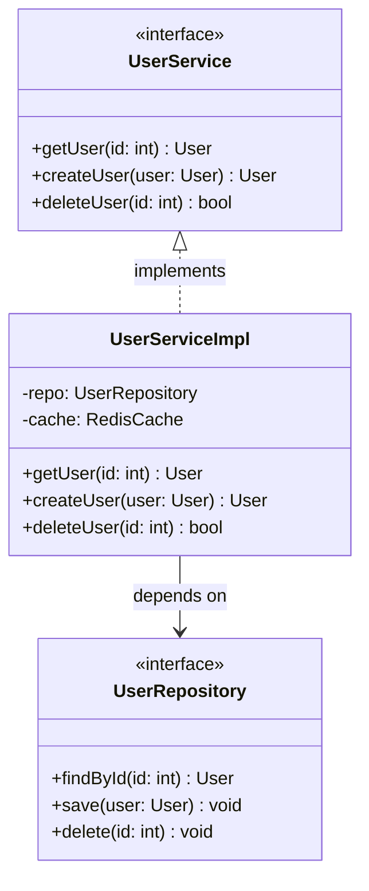

### 继承和实现
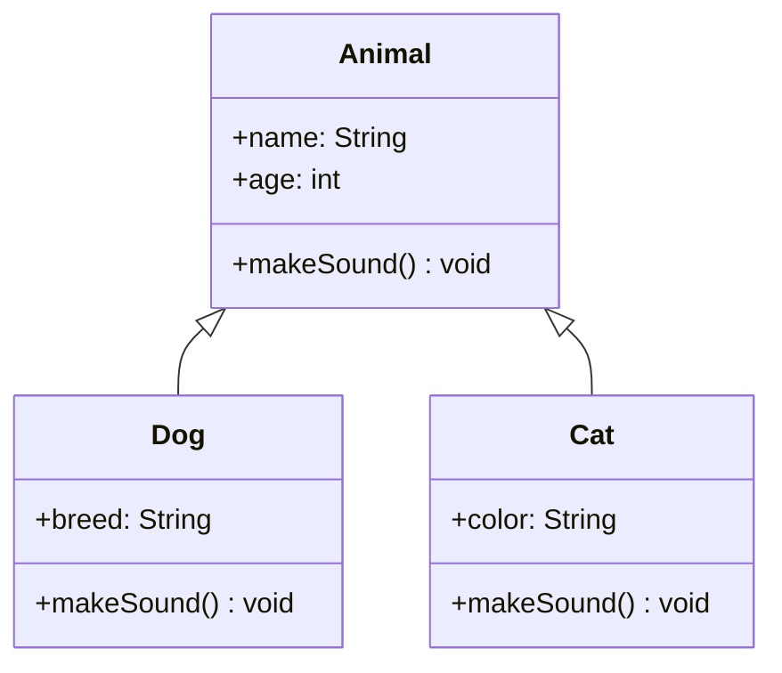

---

## 6. 流程图（Flowchart）- 高级用法

### 泳道图
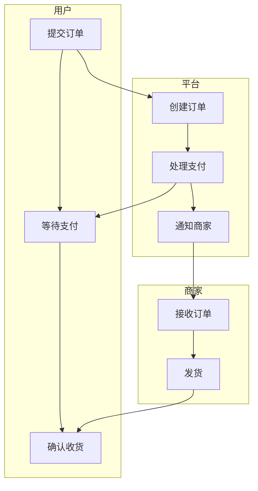

### 决策流程
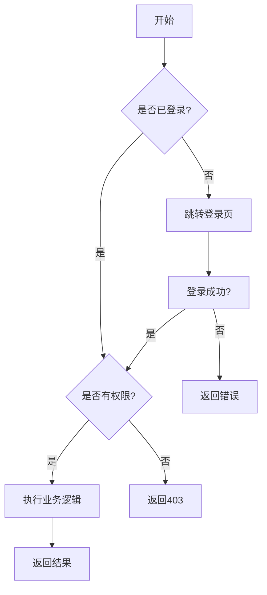

---

## 7. 常用配置

### 主题设置
```
%%{init: {'theme': 'base', 'themeVariables': {'primaryColor': '#4CAF50'}}}%%
```

### 方向设置
| 值 | 方向 |
|----|------|
| TD | 从上到下 |
| TB | 从上到下（同TD） |
| BT | 从下到上 |
| LR | 从左到右 |
| RL | 从右到左 |

### 节点形状
| 语法 | 形状 |
|------|------|
| `A[文本]` | 矩形 |
| `A(文本)` | 圆角矩形 |
| `A([文本])` | 体育场形 |
| `A文本` | 子程序形 |
| `A[(文本)]` | 圆柱形(数据库) |
| `A>文本]` | 非对称形 |
| `A{文本}` | 菱形(判断) |
| `A{{文本}}` | 六边形 |
| `A[/文本/]` | 平行四边形 |
| `A[\文本\]` | 反向平行四边形 |
| `A[/文本\]` | 梯形 |
| `A[\文本/]` | 倒梯形 |

---

## Agent 使用建议

1. **优先使用 Mermaid**：纯文本格式，可 git 版本管理，Markdown 原生支持
2. **图要简洁**：一张图不超过 15 个节点，复杂系统拆分为多张图
3. **标注清晰**：箭头上标注调用方式或数据内容
4. **颜色有意义**：用颜色区分职责域，不要随意上色
5. **配合文字**：图后紧跟文字说明，解释关键决策
