# 技术文档图表 - PlantUML 语法参考

> 本页面提供 PlantUML 各类图表的语法模板，Agent 生成技术文档时可直接参考使用。
> 上级页面：[[技术文档图表-选型指南]]

---

## 1. 用例图（Use Case Diagram）

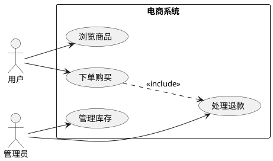

---

## 2. 时序图（Sequence Diagram）

### 基础时序图
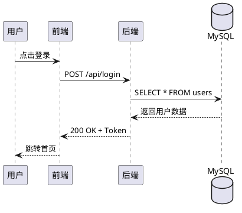

### 带分组和条件
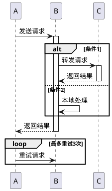

### 自动编号
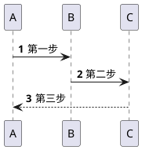

---

## 3. 类图（Class Diagram）

### 基础类图
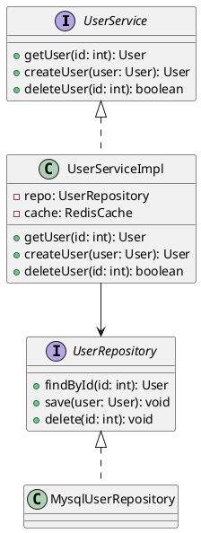

### 关系类型
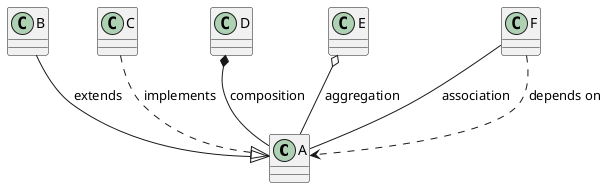

### 抽象类和枚举
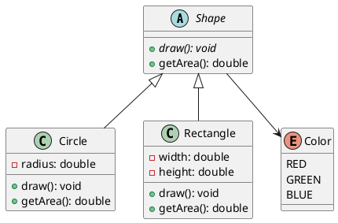

---

## 4. 活动图 / 流程图（Activity Diagram）

### 基础活动图
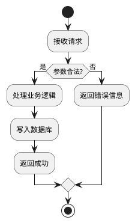

### 泳道图
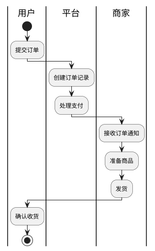

### 并行执行
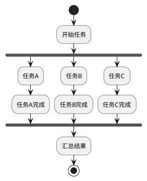

### 循环和条件
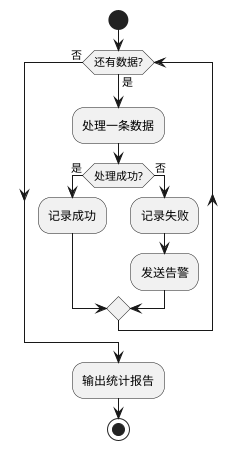

---

## 5. 状态图（State Diagram）

### 基础状态图
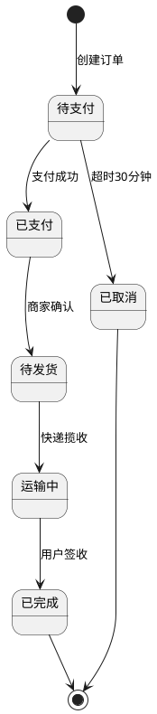

### 复合状态
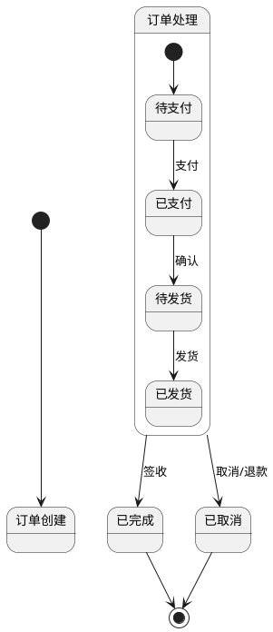

### 带动作和守卫条件
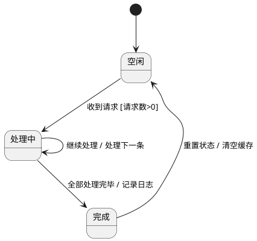

---

## 6. 组件图（Component Diagram）

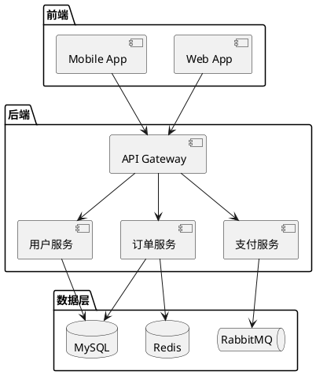

---

## 7. 部署图（Deployment Diagram）

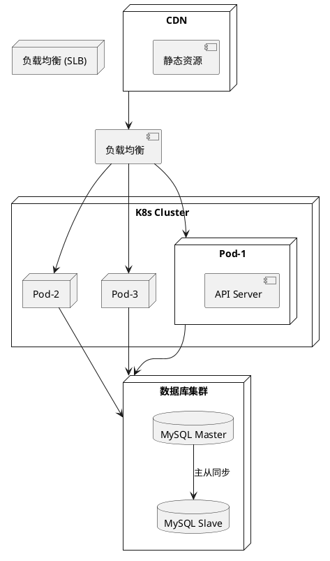

---

## 8. 对象图（Object Diagram）

```plantuml
@startuml
object user1 : User {
    id = 1
    name = "张三"
    email = "zhangsan@example.com"
}

object order1 : Order {
    id = 1001
    amount = 299.00
    status = "PAID"
}

object item1 : OrderItem {
    product_id = 55
    quantity = 2
    price = 149.50
}

user1 --> "1..*" order1
order1 --> "1..*" item1
@enduml
```

---

## 9. 通用样式设置

### 皮肤参数
```plantuml
@startuml
skinparam backgroundColor #FEFEFE
skinparam componentStyle rectangle
skinparam defaultFontName "Microsoft YaHei"
skinparam defaultFontSize 12
skinparam shadowing false
skinparam roundcorner 10
skinparam maxMessageSize 100

' 颜色主题
skinparam sequence {
    ArrowColor #666
    ActorBorderColor #333
    LifeLineBorderColor #999
    ParticipantBackgroundColor #E3F2FD
    ParticipantBorderColor #1565C0
}
@enduml
```

### 常用皮肤参数
| 参数 | 说明 | 示例值 |
|------|------|--------|
| `backgroundColor` | 背景色 | `#FEFEFE` |
| `defaultFontName` | 默认字体 | `"Microsoft YaHei"` |
| `defaultFontSize` | 默认字号 | `12` |
| `shadowing` | 是否显示阴影 | `false` |
| `roundcorner` | 圆角大小 | `10` |
| `linetype` | 线条类型 | `ortho` / `polyline` |

### 颜色定义
```plantuml
' 命名颜色
skinparam componentBackgroundColor LightBlue

' HEX 颜色
skinparam componentBackgroundColor #E3F2FD

' 渐变
skinparam componentBackgroundColor #E3F2FD-#BBDEFB
```

---

## 10. 中文显示注意事项

### 字体设置
```plantuml
@startuml
!define NOTE_FONTNAME "Microsoft YaHei"
skinparam defaultFontName "Microsoft YaHei"
' Windows: "Microsoft YaHei", "SimHei"
' macOS: "PingFang SC", "Heiti SC"
' Linux: "WenQuanYi Micro Hei", "Noto Sans CJK SC"
@enduml
```

### 编码
- PlantUML 文件应保存为 UTF-8 编码
- 在文件开头添加 `@startuml` 和 `@enduml`

---

## Agent 使用建议

1. **PlantUML vs Mermaid 选择**：
   - 需要完整 UML 支持 → PlantUML
   - 需要 Markdown 内嵌 → Mermaid
   - 需要复杂样式控制 → PlantUML
   - 需要 git 友好 → 两者都可以（都是文本）

2. **图表命名规范**：
   - 文件命名：`{文档类型}-{图表类型}.puml`
   - 示例：`arch-sequence-login.puml`、`db-er-order.puml`

3. **图片导出**：
   - 命令行：`plantuml -tpng file.puml`
   - 支持格式：PNG、SVG、PDF、EPS
   - SVG 推荐用于 Web 文档（矢量、可搜索）

4. **与 Mermaid 对照**：

| 图表类型 | Mermaid 关键字 | PlantUML 关键字 |
|---------|---------------|----------------|
| 流程图 | `graph TD/LR` | `start/stop` (活动图) |
| 时序图 | `sequenceDiagram` | `participant/->` |
| ER图 | `erDiagram` | `entity` 或无专用(用类图替代) |
| 状态图 | `stateDiagram-v2` | `[*] -->` |
| 类图 | `classDiagram` | `class/interface` |
| 部署图 | 无原生支持 | `node/artifact` |
| 组件图 | 无原生支持 | `package/component` |
